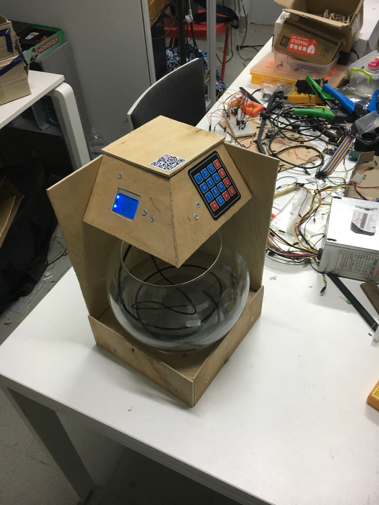
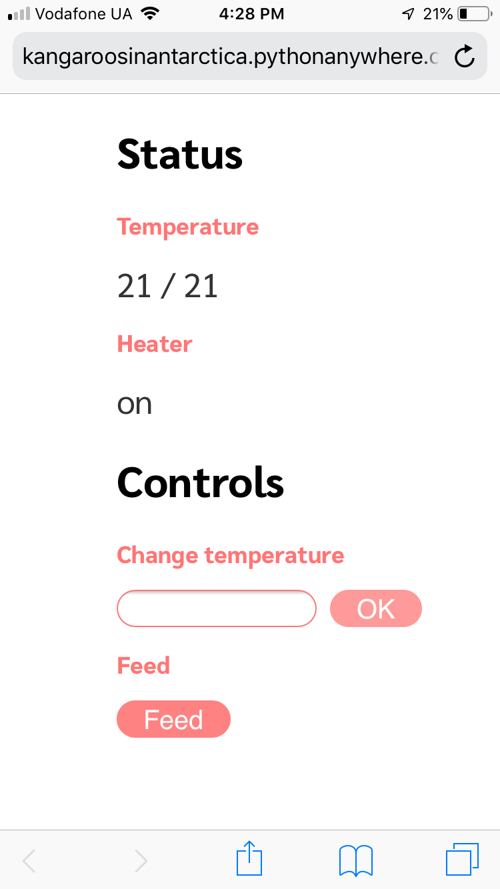
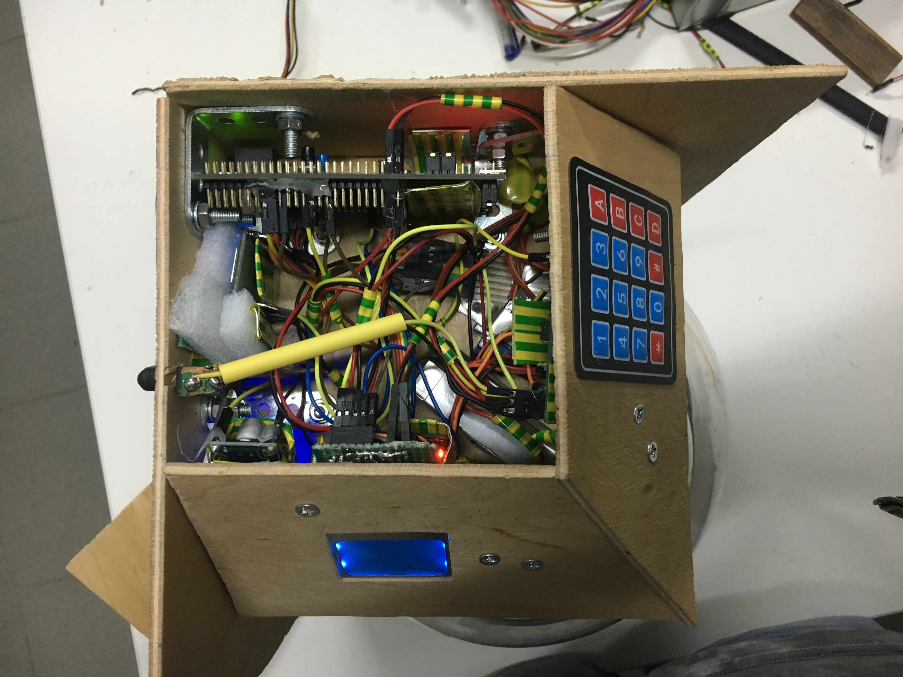
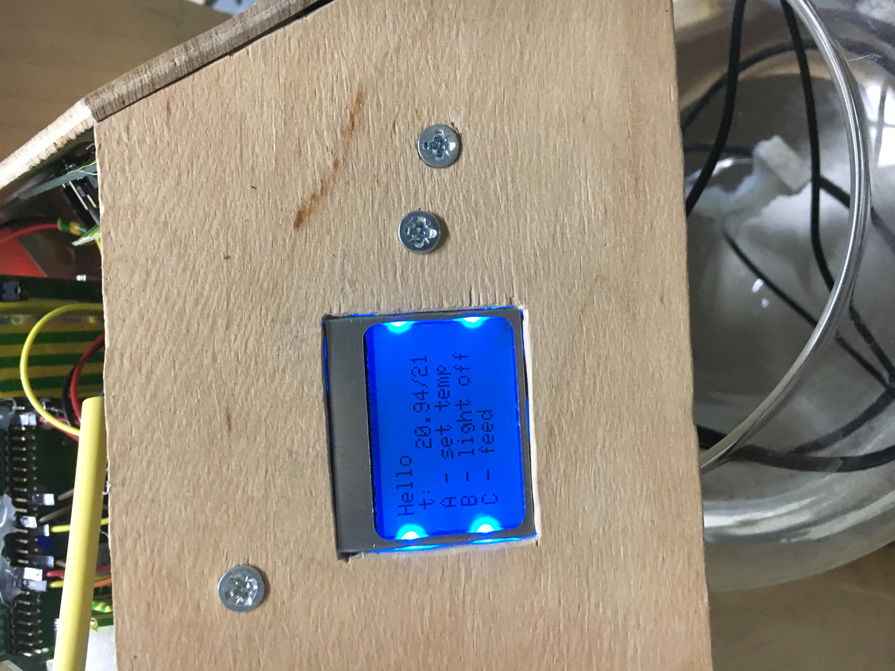
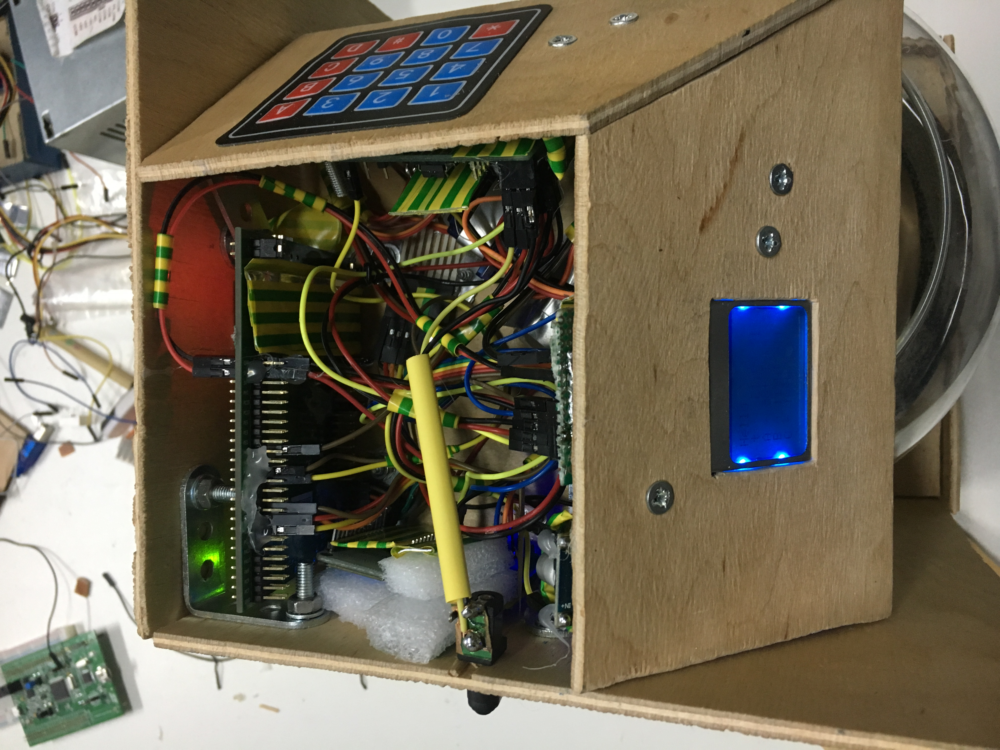
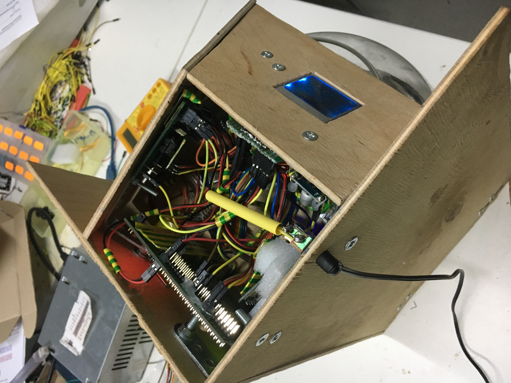
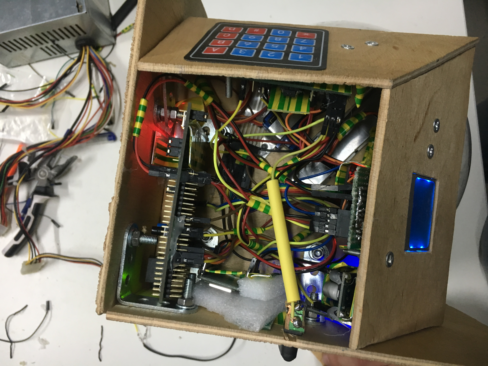

# Aquarium
Automised aquarium with STM32

## Description of the project:
Automated aquarium with the following features:
- temperature measurement
- maintaining given temperature
- feeding
- controls over WiFi
- Automatic failure detection and shut down

## Required elements
1) STM32F4
2) [Display Nokia 5110](https://www.sparkfun.com/datasheets/LCD/Monochrome/Nokia5110.pdf)
3) [Programmable Resolution 1-Wire Digital Thermometer DS18B20](https://datasheets.maximintegrated.com/en/ds/DS18B20.pdf)
4) [2 Relay Modules](https://en.wikipedia.org/wiki/Relay)
5) [Resistor 5W5.1ΩJ](https://en.wikipedia.org/wiki/Resistor)
6) [4x4 Matrix Membrane Keypad](https://www.parallax.com/sites/default/files/downloads/27899-4x4-Matrix-Membrane-Keypad-v1.2.pdf)
7) [SERVO MOTOR SG90](http://www.ee.ic.ac.uk/pcheung/teaching/DE1_EE/stores/sg90_datasheet.pdf)
8) [ESP-12F WiFi Module](https://www.elecrow.com/download/ESP-12F.pdf)
9) [attiny85](https://www.microchip.com/wwwproducts/en/ATtiny85)
10) [NTC 100K thermoresistor](https://en.wikipedia.org/wiki/Thermistor)

## Failure detection with `AT tiny 85`
The Code is located in [/tiny_guard/tiny_guard.ino]() file. It uses the analog pin
to measure the temperature with a `100K thermoresistor`. The thermoresistor is connected
to 5v together with another `100K resistor`. The voltage is then measured on AT-TINY's `A1` pin. 
It could be then converted to current resistance of `thermoresistor` and then to current temperature as shown 
in this [guide](http://robotclass.ru/tutorials/arduino-thermistor-100k/).  

But at-tiny doesn't have enough memory to perform these operations. Thus, it can just measure
the voltage and compare it with the critical voltage, for which the temperature is too high.  
If the temperature (or corresponding to it voltage) is too high, `at-tiny` stops supporting the `STM32` with voltage.  
To convert from current voltage to temperature and vice versa, we wrote the script [temperature](/tiny_guard/temperature.html). 
on `JS`. One can just run it in browser, open console with `F12` and use functions `convertAnalogIntoT()` and `convertTtoAnalogIn()` to 
switch between `at-tiny` voltage measurements and temperature.  

The pin `0` is used to switch the voltage to `STM`. It is connected to a `relay`. Because we connected
the relay to inverse input, it will provide voltage when `OUPUT = 0` and stop it when it is the
maximum value of `255`.

> Note that at-tiny analog in output is between 0 to 1023 (corresponding to voltage from 0 to 5v accordingly).
The analog out (`PWM`) needs to be between 0 to 255 (0 to 5v as before).

## Connection to server with `Node MCU (ESP 8266)`
To control the aquarium over the internet, the following was configured:
1. **Server** to receive and transmit data to both user and aquarium itself.
2. **Node MCU** module to receive data from `STM` using `UART` and transmit it to server.
3. **STM 32** to transmit data to `Node MCU` and process received data correspondingly.
4. **Website** to send data to server about aquarium controls

#### Server
Server needs to do the following:
* Receive and save `current temperature` measurement in the aquarium.
* Save the `required temperature`. Change the required temperature if either user changes it
on website or aquarium manual controls. Send the current required temperature to aquarium (especially 
if the aquarium restarts - to reset previous configurations)
* Show user if aquarium is `currently heating` or not
* Get command to `feed` the fish from user. Display to user when the command is
awaiting to be performed and when finished (on UI button is disabled and enabled back correspondingly).

Server code is written on `Python` and hosted on [pythonanywhere.com](http://kangaroosinantarctica.pythonanywhere.com/aquarium).
Files are in [UquariumServer](UquariumServer).

#### Node MCU
The code is located at [esp_8266_wifi/](esp_8266_wifi/esp_8266_wifi.ino).
The commands that it was programmed to receive using `UART` at `BaudRate 9600` are:
* Get available wifi connections (list of wifi uuids)
* Connect to wifi
* Check whether it is currently connected to wifi
* Disconnect
* Configure request to server
* Send request and get response
* Echo

Most commands ouput if they were successful or not. Also some functions are split into 2 parts.
For example sending something over the internet takes some time. So there are 2 commands: 
- To send the data to a url.
- To check whether the response is ready and receive response.  
The `UART` communication is then managed by `STM` and it never needs to wait for response from Node MCU, just 
check whether there is data to transmit from `Node MCU` when `STM` is ready to receive.

The entire list and usage of commands:  

|COMMAND|DESCRIPTION|ARGUMENTS|RESULT|
|---|---|---|---|
|_READ NETWORKS_| Ask Node MCU to get a list of available wifi networks and store it inside its memory | |`T/F` - already in process|
|_GET NETWORKS_| Send the list of networks retrieved in previous command | | `T/F` - list ready, list itself|
|_WIFI CONNECT_| Connect to wifi | wifi uuid and password | |
|_IS CONNECTED_| Is already connected to wifi | | `T/F` |
|_DISCONNECT_| Force disconnect from wifi | |
|_CONFIGURE_REQUEST_| Configure the next requests to be sent | `POST / GET` request, url | `T/F` - successful |
|_GET CONFIGURATION_| Get current request configuration (to test if everything is ok) | `T/F` - configuration exists, configuration |
|_SEND_REQUEST_| Send request | request `body` | `T/F` - successfully started |
|_GET_RESPONSE_| Get respose | | `T/F` - response for last request received, response body |
|_GET_RESPONSE_CODE_| Get the status code of last response | | `F` if none, `code` otherwise |
|_ECHO_| | | The _ECHO_ command code itself |

All the communication via `UART` is performed using interrupts, so Node MCU can perform
an operation and communicate with master simultaneously.

#### STM 
The corresponding communication code of STM is in **wifi_node_mcu** ([code](Src/wifi_node_mcu.c), [header](Inc/wifi_node_mcu.h))
It has the code to perform operations, used in our project. Also, STM has functions to 
process data from server, change its configurations accordingly and send current
status back to server.

#### Website

## Microcontroller pin configuration
General configuration of pins:

### Display:

For dislpay we need 8 pins, we connect it as follows: `RST - PB10`, `CE - PB14`, `DC - PB12`, `DIN - PB15`, `CLK -PB13`, `VCC - 5V`, `BL - PB7`, `GND - Ground`.
The functions for display is in [aq_interface.c](Src/aq_interface.c)

### `DS18B20` Thermometer:

For thermometer we need 3 pins. Thermometer uses OneWire interface for communication using [external library](https://stm32f4-discovery.net/2015/07/hal-library-05-onewire-for-stm32fxxx/). Functions to work with it are in [aq_controller.c](Src/aq_controller.c).

To address the thermometer we use the `SKIP ROM` `[CCh]` command (Which addresses all one wire slaves on the line. 
In our case there is only one - thermometer, so we address just it. But one can also use its ROM code for this).

After that we send the `Convert T` `[44h]` command to order the thermometer to perform its measurements and 
convert to required output. If we start reading, the thermometer will transmit `0` until the operation finishes.

The `Read Sketchpad` `[BEh]` is used to get the measured data from thermometer. The temperature is send in the first 2
bytes, lower bit first. The measurement needs to be further divided by `16`, because its `4` least significant bits 
are after the floating point. The error of measurement is `±0.5 °C`.
 
### Relay and resistor
We first wanted to connect the heating resistor, using a darlington transistor array: 

But it didn't prove to be worthful for such high voltage, so we needed to use a Relay instead.  
The Relay is connected to `PB7` pin, as on image. The pin is connected to Relay's signal input. The resistor
is connected serially to relays `NO` and `COM`. This all is connected to `12V`. With such configuration the resistor
is off when `STM` has no voltage or outputs `HIGH`. It has voltage and is heating if `STM` outputs `LOW`. 

Functions for maintaining of temperature is in [aq_controller.c](Src/aq_controller.c).

### Keyboard:

The keyboard has `4 inputs` and `4 outputs`. If a button is pressed, voltage is able to flow through one
pair of the `outputs` and `inputs`. But because one cannot determine which exact button is pressed if all
the `inputs` are `HIGH`, we needed to turn the `inputs` one by one and measure the `outputs` also one
by one to determine which exact pair is connected - and so determine which button was pressed.  
Because most of the time keyboard is not pressed, the code checks for which button is pressed only
after an interrupt from the `input pins` is received (Of course, the voltage should be `HIGH` at `keyboard inputs` at this time. Otherwise we wouldn't get the `interrupt`).  
Also the input needs to be pulled, so that we can always read meaningful information from keybaord.  

#### Connection:
From left to right first four for output - `PD8-PD11`, next four for input - `PD0-PD3` (configured for interrupt).

The code for keyboard is in [keyboard.c](Src/keyboard.c).

### SERVO MOTOR SG90

For working with SERVO MOTOR SG90 we need 3 pins, PB8 for output, Vcc and Ground.  
Servo receives `PWM` signal and rotates correspondingly to the `duty cycle` of it. 
(`-90deg` to `90deg` corresponding to cycle of `1ms` to `2ms`) The `period` is `20ms`.

The code for it is in [aq_dispancer.c](Src/aq_dispancer.c).

## Photo

