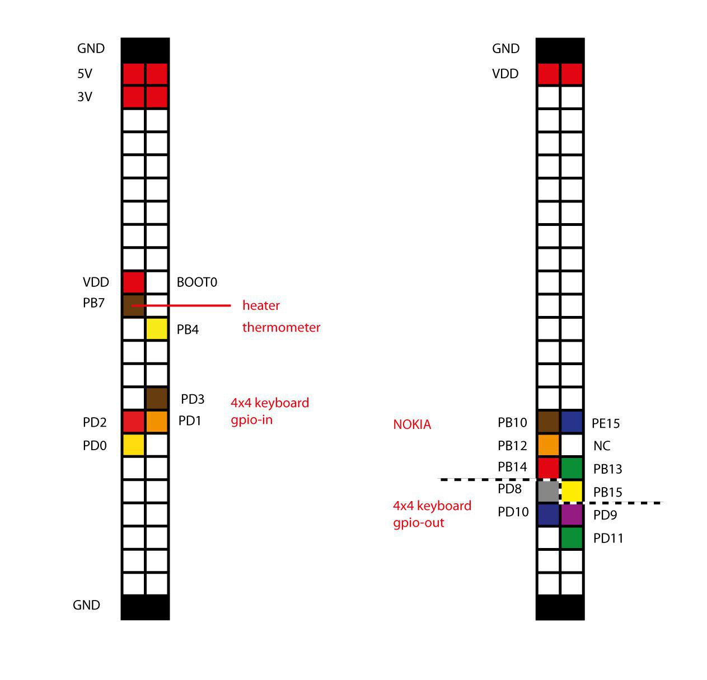
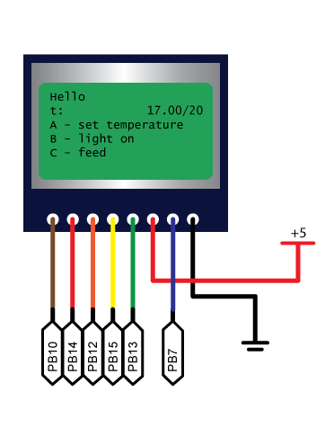
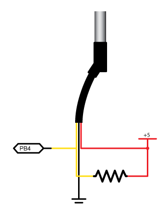
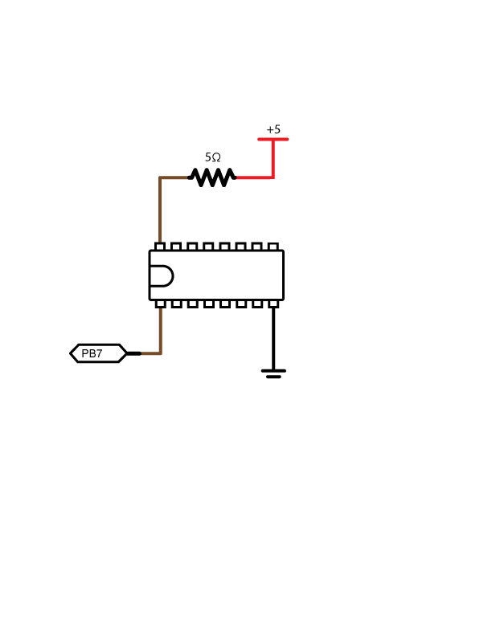
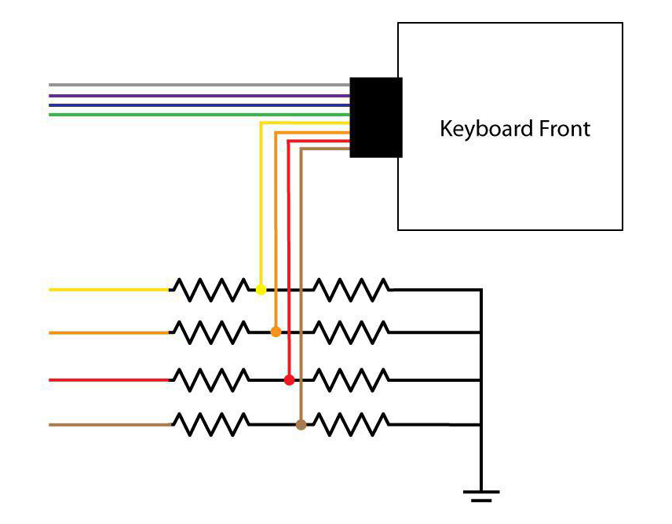
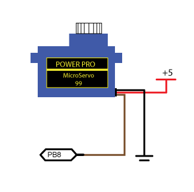

# Aquarium
Automised aquarium with STM32

## Description of the project:
Automated aquarium with the following features:
- temperature measurement
- maintaining given temperature
- feeding
- managing by wi-fi

## Required elements
1) STM32F4
2) [Display Nokia 5110](https://www.sparkfun.com/datasheets/LCD/Monochrome/Nokia5110.pdf)
3) [Programmable Resolution 1-Wire Digital Thermometer DS18B20](https://datasheets.maximintegrated.com/en/ds/DS18B20.pdf)
4) [SEVEN DARLINGTON ARRAYS](http://pdf1.alldatasheet.com/datasheet-pdf/view/25566/STMICROELECTRONICS/ULN2003A.html)
5) Resistor 5W5.1ΩJ
6) [4x4 Matrix Membrane Keypad](https://www.parallax.com/sites/default/files/downloads/27899-4x4-Matrix-Membrane-Keypad-v1.2.pdf)
7) [SERVO MOTOR SG90](http://www.ee.ic.ac.uk/pcheung/teaching/DE1_EE/stores/sg90_datasheet.pdf)
8) [ESP-12F WiFi Module](https://www.elecrow.com/download/ESP-12F.pdf)

## Microcontroller pin configuration
General configuration of pins:

### Display:

For dislpay we need 8 pins, we connect it as follows: RST - PB10, CE - PB14, DC - PB12, DIN - PB15, CLK -PB13, VCC - 5V, BL - PB7, GND - Ground.
The functions for display is in [aq_interface.c](Src/aq_interface.c)

### Thermometer:

For thermometer we need 3 pins. Thermometer use OneWire interface for communication using [external library](https://stm32f4-discovery.net/2015/07/hal-library-05-onewire-for-stm32fxxx/). Functions to work with it is in [aq_controller.c](Src/aq_controller.c).

### Darlington and resistor

Connect input of Darlington to PB7, as on image. Functions for maintaining of temperature is in [aq_controller.c](Src/aq_controller.c).

### Keyboard:

From left to right first four for output - PD8-PD11, next four for input - PD0-PD3 (configured for interrupt).
The code for keyboard is in [keyboard.c](Src/keyboard.c).

### SERVO MOTOR SG90

For working with SERVO MOTOR SG90 we need 3 pins, PB8 for output, Vcc and Ground. The code for it is in [aq_dispancer.c](Src/aq_dispancer.c).

### WiFi Module
